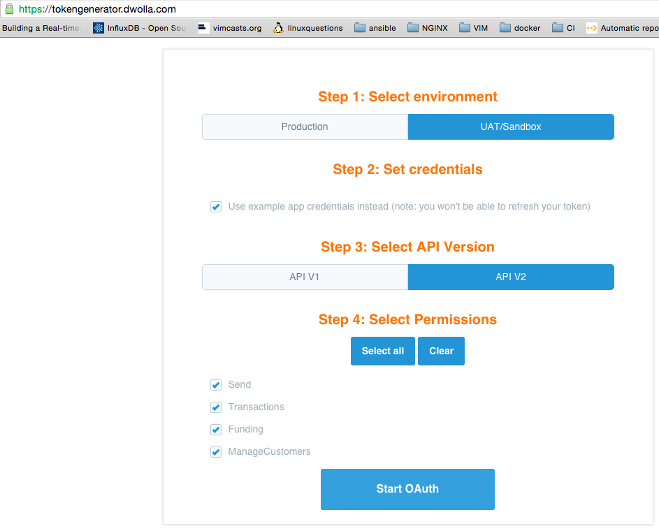
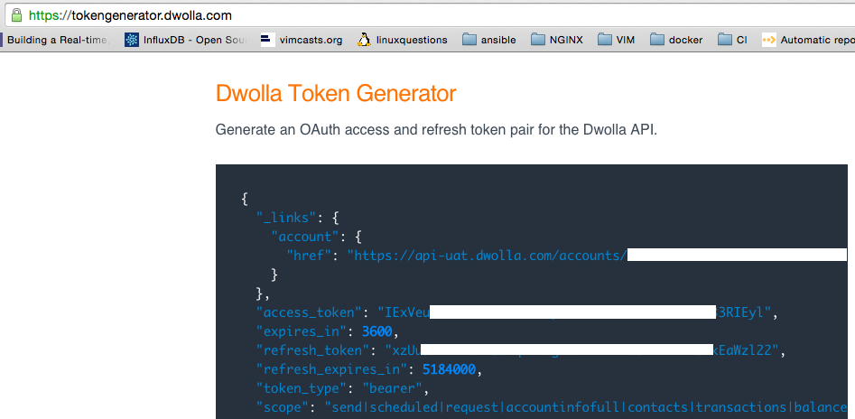

# transfer money between users with Dwolla's Ruby SDKs

Execute the steps for transferring money between users described at [developers.dwolla.com/guides](https://developers.dwolla.com/guides/transfer-money-between-users) with two of Dwolla's Ruby clients:

* **dwolla_swagger**
 ([github.com/Dwolla/dwolla-swagger-ruby]((https://github.com/Dwolla/dwolla-swagger-ruby)))
* **dwolla_v2** ([github.com/Dwolla/dwolla-v2-ruby]((https://github.com/Dwolla/dwolla-v2-ruby)))

## install

Clone this repository:

	$ git clone github.com/gpolyn/transfer-money-between-users-with-dwolla-and-ruby.git

If you prefer the incomplete guide implementation using **dwolla_v2**, switch branch:
	
	$ git checkout dwolla_v2

Install dependencies:

    $ bundle install

## configure (**dwolla_swagger** *master* branch)

There may be a more elegant/programmatic way to obtain the access token, but the following steps worked for me:

1. (Register at [uat.dwolla.com](https://uat.dwolla.com))
2. Request a token at [tokengenerator.dwolla.com](https://tokengenerator.dwolla.com)

3. Follow redirect to login and authorize the scope
4. Collect 'access_token'

Encode the token as *DWOLLA_UAT_ACCESS_TOKEN*, perhaps as follows:

	$ export DWOLLA_UAT_ACCESS_TOKEN=[acces_token]

## usage (**dwolla_swagger** *master* branch)

Steps outlined at [developers.dwolla.com/guides/transfer-money-between-users](https://developers.dwolla.com/guides/transfer-money-between-users) are implemented in **.rb** files with matching names. Run the whole guide at once:

	$ ruby check-the-status-of-your-transfer.rb

(**dwolla_swagger** is not used for all API calls in **attach-a-verified-funding-source-with-microdeposits.rb**, after errors arose using the SDK for the micro-deposit resource.)

## TODO (**dwolla_swagger** *master* branch)

Swap out **typheous** for **dwolla_swagger** to handle *all* API calls in **attach-a-verified-funding-source-with-microdeposits.rb**.
